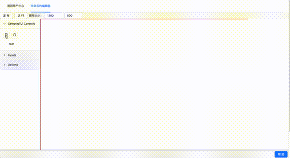
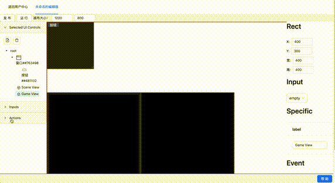
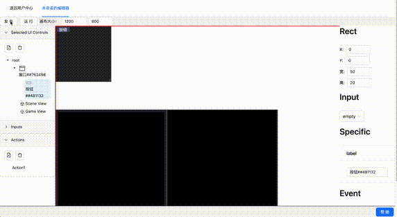
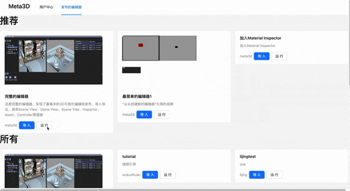

# Meta3D

Meta3D是开源Web3D低代码平台，快速搭建Web3D编辑器，共建开放互助的web3d生态

   

[文档](https://meta3d-website.4everland.app/docs/%E7%AE%80%E4%BB%8B) • [搭建的编辑器Demo](https://meta3d-production-5eol5gce9a6b9c-1302358347.tcloudbaseapp.com/EnterApp?account=meta3d&appName=%E5%AE%8C%E6%95%B4%E7%9A%84%E7%BC%96%E8%BE%91%E5%99%A8) • [进入平台](https://meta3d-production-5eol5gce9a6b9c-1302358347.tcloudbaseapp.com/)

<!--  -->

**加入UI Control**

**加入Action脚本**

**发布编辑器**

**导入编辑器**

**运行“完整的编辑器”模板**

<!-- Meta3D现在处于公开内测中，已经完成了基本的案例，您可以开始使用，欢迎您来一起共建开源社区！

后面Meta3D会发布更多和引擎和编辑器相关的扩展，从而使用户可以直接组装已有的扩展来搭建出完整的引擎和编辑器！谢谢支持！ -->

> Meta3D现在处于v1.0版本公测中，这是可用版本，欢迎大家使用，并来这里[讨论](https://github.com/Meta3D-Technology/Meta3D/discussions/43)，感谢您~

<!-- 已经完成了基本的案例，您可以开始使用，欢迎您来一起共建开源社区！

后面Meta3D会发布更多和引擎和编辑器相关的扩展，从而使用户可以直接组装已有的扩展来搭建出完整的引擎和编辑器！谢谢支持！ -->

## 特性

- **一切皆扩展**
积木式搭建自己的“Web3D编辑器”，完全可扩展
- **只开发一次**
一个需求只实现一次，到处复用

- **Web3 Dapp**
拥抱Web3，完全开源

## 优势

- 世界首个搭建Web3D编辑器的低代码平台
- 一切皆可扩展，用户可100%自定义    
目前暂时只开放了“写逻辑代码”的扩展方法，未来将会开放更多的扩展方法
- 拥抱Web3，完全开源

## 支持和社区

- 💬 [点这里](http://qm.qq.com/cgi-bin/qm/qr?_wv=1027&k=r1Z4Z5uToIO1dISsXvdJvQOtFr3IoPJx&authKey=Ft1KpywYZrlO4yUGQj5jCliI4DaVf4hkM5jiiZtm195Ei4bSNiwo1SHEogLcrc%2Fp&noverify=0&group_code=568338939)加QQ群，与我们交流
- 📄 [文档](https://meta3d-website.4everland.app/docs/%E7%AE%80%E4%BB%8B)中找到解决方案
- ⚠️ [Github](https://github.com/Meta3D-Technology/Meta3D/issues/new/choose)上提Issue
- 👾 [论坛](https://github.com/Meta3D-Technology/Meta3D/discussions)上寻求帮助
<!-- - 💡 [案例]()作为学习资料 -->

 
## 如何贡献

我们爱贡献者！欢迎贡献，共建Web3D生态！

如果您希望对Meta3D进行贡献，请阅读[CONTRIBUTING](CONTRIBUTING.md)

### Roadmap
[这里](https://github.com/orgs/Meta3D-Technology/projects/1/views/1)有Meta3D详细的开发规划。未来会支持定制Web3D引擎、开放各种市场等

<!-- ### 贡献者 -->

<!-- TODO
refer to [README.MD 中生成贡献者名单](https://www.jianshu.com/p/495bb77eb672) -->

